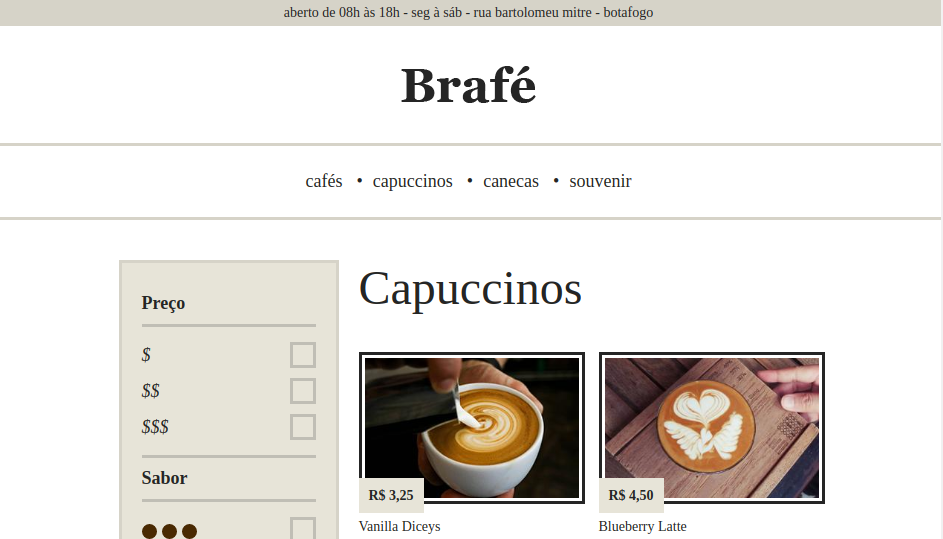

<h1 align="center">
    
</h1>


<p align="center">
  
	
  

  
  
  <a href="https://github.com/marcelo-rafael/css-brafe-2-puro/commits/master">
    
  </a>

  <a href="https://github.com/marcelo-rafael/css-brafe-2-puro/issues">
    
  </a>

  <a href="https://github.com/marcelo-rafael/css-brafe-2-puro/blob/master/LICENSE.md">
    
  <a>
   
   <a href="https://github.com/marcelo-rafael/css-brafe-2-puro/stargazers">
    
  </a>
  
  <a href="https://github.com/marcelo-rafael/css-brafe-2-puro/stargazers">
    
  </a>
  
  <a href="https://github.com/marcelo-rafael/css-brafe-2-puro/stargazers">
    
  </a>
</p>

<h4 align="center"> 
	🚧  Brafé 🚧
</h4>
<p align="center">Deployed <a href="https://marcelo-rafael.github.io/css-brafe-2-puro/">here</a>.</p>

# :pushpin: Table of Contents

* [About](#computer-about)
* [Installation](#construction_worker-installation)
* [Tech Stack](#rocket-tech-stack)
* [Found a bug? Missing a specific feature?](#bug-issues)
* [Contributing](#tada-contributing)
* [Author](#man-author)
* [License](#closed_book-license)

---

# :computer: About

Brafe is a CSS project for positioning elements and how they act on the website layout.
 💜

Project developed during the Advanced CSS Positioning, course offered by the [Origamid](https://www.origamid.com/curso/css-avancado-posicionamento)

---

# :construction_worker: Installation


This project is done in one part

1. Frontend (caravan folder)

#### Running the web application (Frontend)

```bash

# Clone this repository
$ git clone https://github.com/marcelo-rafael/css-brafe-2-puro

# Access the project folder in your terminal
$ cd css-brafe-2-puro


```

---

# :rocket: Tech Stack

The following tools were used in the construction of the project:

-   **[css](https://www.w3schools.com/css/)**

---

# :bug: Issues

Feel free to **file a new issue** with a respective title and description on the the [css-brafe-2-puro](https://github.com/marcelo-rafael/css-brafe-2-puro/issues) repository. If you already found a solution to your problem, **i would love to review your pull request**! Have a look at our [contribution guidelines](https://github.com/marcelo-rafael/css-brafe-2-puro/blob/master/CONTRIBUTING.md) to find out about the coding standards.

---

# :tada: Contributing

1. Fork the project.
2. Create a new branch with your changes: `git checkout -b my-feature`
3. Save your changes and create a commit message telling you what you did: `git commit -m" feature: My new feature "`
4. Submit your changes: `git push origin my-feature`
> If you have any questions check this [guide on how to contribute](./CONTRIBUTING.md)

---

# :man: Autor


[](https://www.linkedin.com/in/marcelo-rafael-gonçalves/) 
[](mailto:marcelo.rafael.goncalves@gmail.com)

---

# :closed_book: License

This project is under the [MIT](./LICENSE).


Made with love by [Marcelo Rafael](https://github.com/marcelo-rafael) 💜🚀
